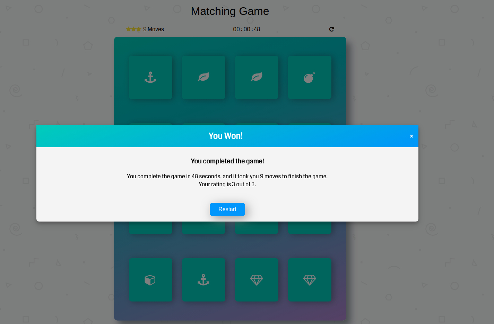

# Memory Game
This is a shnazzy, well-designed, feature-packed memory game. To win this game, you have to find out all the match patterns on the deck. The game can be played [here](https://shijingl.github.io/Browser-Game-Project).

### How the game works
The game board consists of sixteen "cards" arranged in a grid. The deck is made up of eight different pairs of cards, each with different symbols on one side. The cards are arranged randomly on the grid with the symbol face down. The gameplay rules are very simple: flip over two hidden cards at a time to locate the ones that match!

Each turn:
* The player flips one card over to reveal its underlying symbol. 
* The player then turns over a second card, trying to find the corresponding card with the same symbol.
* If the cards match, both cards stay flipped over.
* If the cards do not match, both cards are flipped face down.
* The game ends once all cards have been correctly matched.

### Technical
#### Assets
This project consists of the following assets: 
* `index.html` The HTML files that contains the general structure of the game
* `app.css` All the styling
* `app.js` All the functions of the game

#### How the game is designed and implemented

-How it's developed
--build a grid of cards
--add functionalities to handle clicks
--work on matching logics
--create winning conditions
--implement additonal functionalities
--styling

### Credits
* For shuffling the cards shuffle javaScript function was used from http://stackoverflow.com/a/2450976

### Tools Used
* [Fontawesome](https://fontawesome.com/icons?from=io) was used to display game card's icons.
